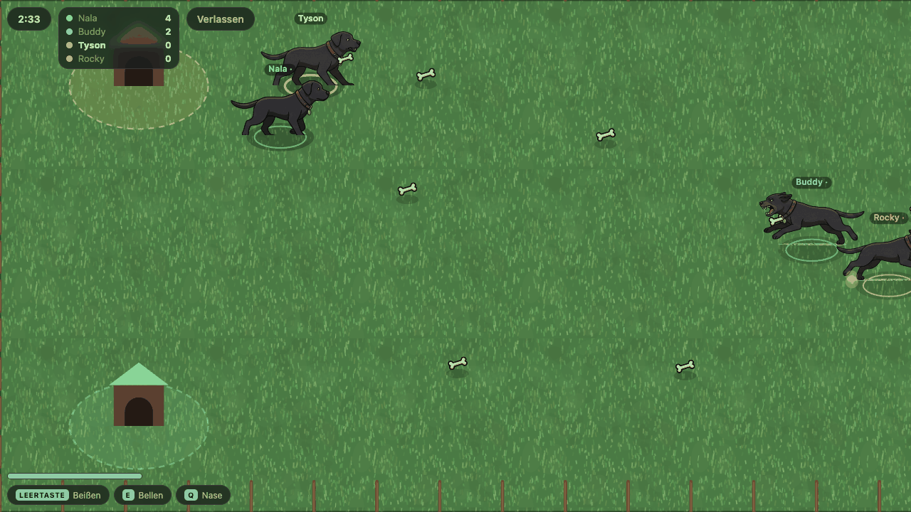
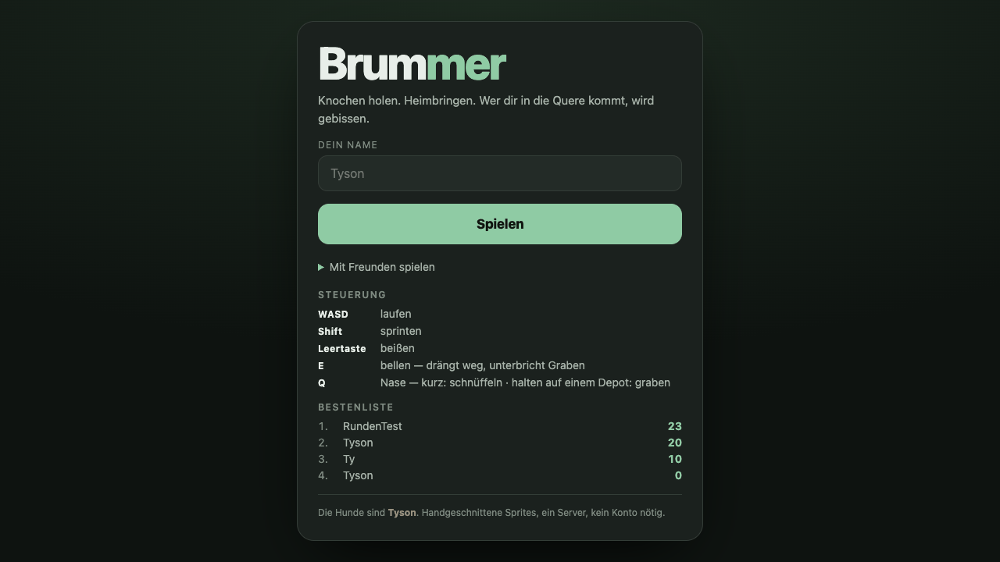
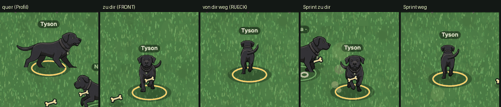

# Brummer

<p>
  <a href="https://brummer.celox.io"></a>
  <a href="LICENSE"></a>
  <a href="https://github.com/pepperonas/brummer/commits/main"></a>
  
</p>
<p>
  
  
  
  
</p>
<p>
  
  
  
  
</p>
<p>
  
  
  
  
  
  
</p>

Ein Online-Arenaspiel für 2–8 Spieler, gebaut aus einer Sammlung Sprite-Blätter
von **Tyson** — einem schwarzen Labrador-Rottweiler-Mischling.

**Spielen: https://brummer.celox.io** — ohne Konto, ohne Installation.

Knochen holen, im Maul zur eigenen Hütte tragen, abliefern. Wer gebissen wird,
verliert ihn auf der Stelle. Drei Minuten pro Runde, die meisten Knochen
gewinnen.



<sub>Oben links stehen Restzeit und **Arena-Code** — antippen kopiert ihn, damit
Freunde in genau diese Runde kommen. Bots füllen freie Plätze, ihre Namen stehen
ohne Fettdruck in der Tabelle.</sub>

---

## Warum das Spiel so aussieht, wie es aussieht

Die Zeichnungen kamen zuerst, das Spiel danach. Sie enthalten keine zufällige
Posensammlung, sondern eine fast vollständige Verb-Liste — und jede Pose ist
zu einer Mechanik geworden:

| Gezeichnete Pose | Mechanik im Spiel |
|---|---|
| Traben, Gehen | Grundbewegung in acht Richtungen |
| Rennen mit Staubwolke | Sprint mit Ausdauerleiste |
| Hechtsprung mit offenem Maul | **Biss** — Gegner verliert Knochen, 1,4 s betäubt |
| Bellen, Knurren | Druckwelle: schiebt weg, unterbricht Graben |
| Schnüffeln mit Duftspur | **Fährte** — zeigt vergrabene Depots im Umkreis |
| Nase am Boden, Truhe | **Buddeln** — Depot mit 3 Knochen, 2 s wehrlos |
| Schlafen mit Z-Z-Z | Betäubt am Boden |
| Kopfportraits (fröhlich/knurrend) | HUD und Meldungen |

Zwei Entscheidungen tragen den Rest:

**Perspektive.** Alle Laufsprites sind reines Profil. Ein Spiel von oben bräuchte
Draufsichten, ein Plattformer bräuchte Level-Tilesets — beides gibt es nicht.
Also die **2,5-D-Ebene der Beat-'em-ups**: Bewegung in acht Richtungen auf einem
Boden, Sprites bleiben seitlich, Tiefensortierung nach Y. Sie kommt mit einer
Bodentextur, einem Zaun und vier Hütten aus — alles ohne Charakterkunst
herstellbar.

**Ein Knochen im Maul.** Das erzwingt den Rückweg durch die Arena und macht
jeden Träger zum lohnenden Ziel. Ohne diese Regel sammelt jeder in seiner Ecke
und niemand beißt.

## Der Einstieg

Kein Konto, kein Ladebildschirm: Name eintragen, „Spielen", man steht in der
Arena. Der Beitritt sucht die nächste offene Runde; wer mit Freunden spielen
will, klappt den vierstelligen Arena-Code auf.

**Gesteuert wird wahlweise mit Maus oder Tastatur.** Linke Maustaste halten
lässt den Hund zum Zeiger laufen (wie in Diablo), die rechte beißt; WASD und
Leertaste tun dasselbe. Auf dem Handy: virtueller Stick links, Knöpfe rechts.



Die Bestenliste hängt an einem sechsstelligen **Spielercode**, den der Server
beim ersten Beitritt vergibt und der Browser behält — kein Passwort, keine
E-Mail. Wer den Code kennt, hat seine Statistik auf jedem Gerät.

## Aufbau

```
artwork/     die acht Original-Blätter (JPEG, farbiger Grund)
tools/       Asset-Pipeline: schneiden, freistellen, Atlas packen
shared/      sim.js -- die Simulation, die Server UND Client rechnen
server/      autoritativer Spielserver (Node + ws + SQLite)
client/      Canvas2D-Client (Vite, kein Framework)
```

### Die Simulation liegt in `shared/`

`shared/sim.js` läuft **wortgleich** im Server (autoritativ) und im Client
(Vorhersage). Der Client wendet jede Eingabe sofort lokal an und behält sie;
kommt ein Schnappschuss, wird die eigene Figur auf den Serverzustand gesetzt und
alle seither ungequittierten Eingaben werden erneut abgespielt. Gemessene
Abweichung im Betrieb: **0,3 Welteinheiten** bei einem 68 Einheiten breiten Hund.

Fremde Figuren werden dagegen interpoliert und bewusst 90 ms in der
Vergangenheit gezeichnet — sonst müsste man bei jedem verlorenen Paket raten.

Treffer werden **ausschließlich serverseitig** geprüft. Der Client schickt nur
Eingaben, nie Positionen; Richtungswerte und Tastenmaske werden geklemmt.

## Entwickeln

```bash
# Server (Port 4263)
cd server && npm install && npm start

# Client mit Hot-Reload (Port 5180, leitet /api und /ws an 4263 weiter)
cd client && npm install && npm run dev

# Tests (137 gruen, ohne Fremdpakete -- node --test)
cd server && npm test      # 61: Simulation, Spielregeln, Datenhaltung, Vertraege
cd client && npm test      # 76: Eingabe, Animation, Zeigersteuerung, Meta-Angaben
```

Die Suiten decken auch die Stellen ab, die in **zwei** Dateien stehen und
deshalb still auseinanderlaufen können: die Reihenfolge der Posen, die
Spaltenordnung des Schnappschusses und das Code-Alphabet. `server/test/contract.test.js`
liest dafür beide Seiten aus dem Quelltext aus, statt sie abzuschreiben —
die erste Fassung tat Letzteres und blieb bei einer eingeschobenen Spalte grün.

### Grafik neu erzeugen

Nur nötig, wenn sich in `artwork/` etwas ändert:

```bash
python3 tools/cut_sprites.py    # 4x4-Raster schneiden, freistellen, beschneiden
python3 tools/cut_props.py      # lose Gegenstände (Knochen)
python3 tools/pack_atlas.py     # Atlas + Phaser-JSON nach client/public/assets/

# Ergebnis durchblättern (Zwiebelhaut zeigt Ausrichtungsfehler)
python3 -m http.server 8123 && open http://localhost:8123/tools/sprite-lab.html
```

Braucht Python mit Pillow und ImageMagick.

## Was beim Bauen wichtig war

**Die Blätter sind Posen, keine Animationszyklen.** Die vier Bilder einer Reihe
sind Varianten, keine Phasen einer Laufbewegung. Gemessen an der Rückenhöhe über
der Bodenlinie zerfallen sie in zwei saubere Gangarten: „aufrecht" (144–155 px)
und „geduckt" (124–134 px). Mischt man sie, pumpt der Hund beim Laufen mit dem
Kopf. Getrennt ergeben sie einen **5-Frame-Laufzyklus mit 3 px Streuung** und
einen eigenen Schleichgang, der jetzt das Tragen darstellt. Alles Weitere —
Wippen, Stauchen, Staub — ist prozedural.

**Freistellen ist das Nadelöhr, nicht das Spiel.** JPEG auf einfarbigem Grund,
kein Alphakanal. Die Flutfüllung läuft von den Rändern (nicht global — das risse
Löcher in alles im Hund, was zufällig ähnlich hell ist), dann Despill und weiche
Kante. Die gezeichneten Bodenschatten überleben das, weil sie die Füllung nicht
erreicht: sie sind **hell und grün-dominant**, während das Fell neutral ist —
diese Kombination trifft ausschließlich Schatten.

**Tyson läuft in alle Richtungen.** Die ursprünglichen Blätter zeigen ihn
ausschließlich im Profil — beim Laufen nach oben oder unten stand deshalb
dasselbe Seitenbild da. Ein nachgezeichnetes Blatt liefert jetzt echte Front-
und Rückansichten (Gehen je vier Bilder, Galopp dazu):



Dazwischen trägt die **Tiefenachse**: je senkrechter die Bewegung, desto
schmaler die Silhouette (bis 42 %), dazu ±6 % Größe — weg wird kleiner, her
wird größer. Umgeschaltet wird mit weiter Hysterese, sonst kippt die Ansicht bei
jedem Rempler im Gedränge zurück.

Wie das Blatt entstanden ist — Prompt, Vorgaben und der Weg ins Spiel — steht in
**[`docs/neue-sprites.md`](docs/neue-sprites.md)**.

**Der Atlas ist ohne Dithering quantisiert.** Bei 220 Farben ist kein Unterschied
zu sehen, die Datei aber rund ein Viertel so groß (damals gemessen 709 → 170 kB;
heute 223 kB bei 32 Bildern, seit die Front- und Rückansichten dazugekommen
sind). *Mit* Dithering rauscht das schwarze Fell sichtbar.

**Kein Spiel-Framework.** Phaser wiegt ~1,3 MB, gebraucht würde davon der
Atlas-Loader. Tiefensortierung, 2,5-D-Projektion und Animation sind ohnehin
selbst geschrieben. Der gesamte Client wiegt **29 kB JavaScript** (11,5 kB gzip)
plus 8 kB CSS und 223 kB Grafik.

## Lizenz

Der **Quelltext** steht unter der [MIT-Lizenz](LICENSE).

Die **Zeichnungen** nicht — Bedingungen in [LICENSE-ARTWORK.md](LICENSE-ARTWORK.md):
alle Bilder zeigen Tyson und bleiben urheberrechtlich geschützt (© 2026 Martin
Pfeffer, alle Rechte vorbehalten). Sie dürfen mit diesem Projekt weitergegeben,
aber nicht getrennt davon verwertet oder in anderen Projekten eingesetzt werden.
Wer den Code nachnutzen möchte, ersetzt sie durch eigene — die Pipeline in
`tools/` baut den Atlas aus beliebigen 4×4-Rasterblättern.

> Die beiden Dateien sind bewusst getrennt: mit dem Bild-Anhang direkt in
> `LICENSE` erkennt GitHub die MIT-Lizenz nicht mehr („not identifiable").
